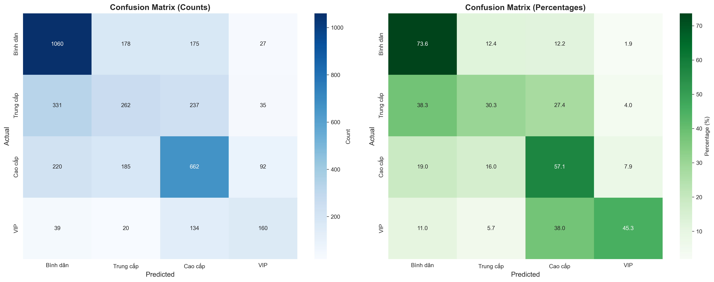
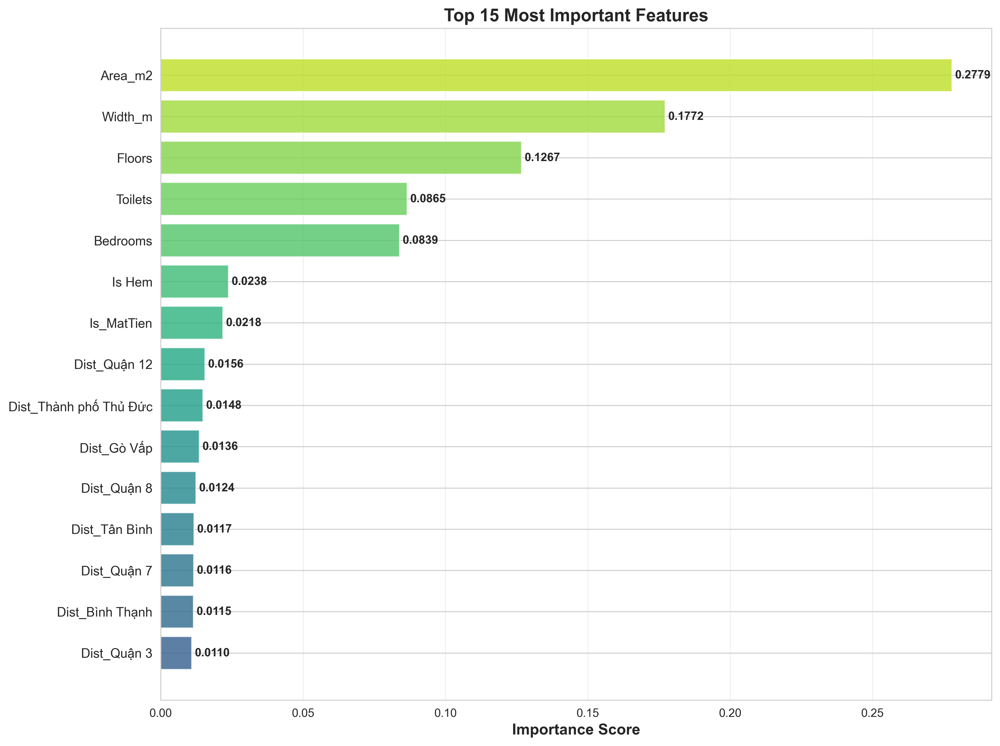
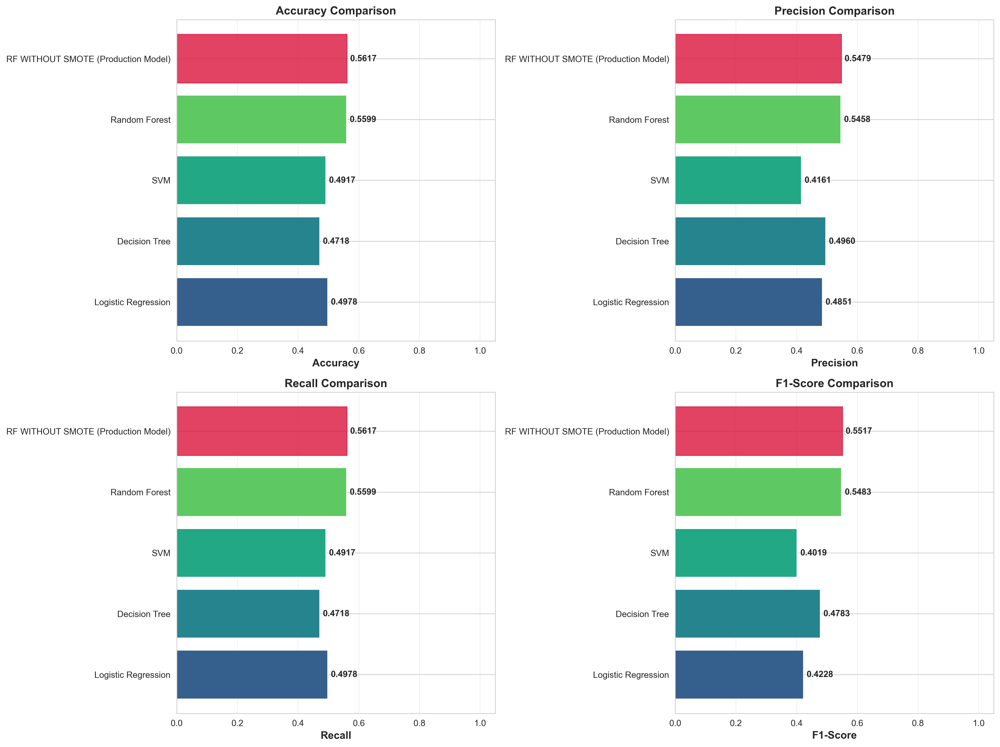
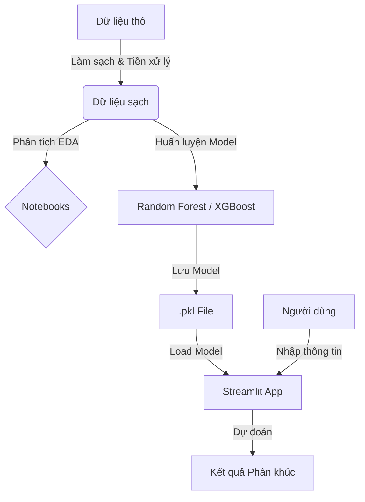

# 🏡 Dự đoán Phân khúc Nhà Đất TP.HCM

Dự án này sử dụng Machine Learning để phân loại phân khúc nhà đất tại Thành phố Hồ Chí Minh dựa trên các đặc điểm như diện tích, vị trí, số phòng, và giá bán.

## 📂 Cấu trúc Dự án

Dưới đây là sơ đồ tổ chức thư mục của dự án:

```
Phan-Loai-Nha-Dat/
├── app/                  # Chứa mã nguồn ứng dụng Streamlit
│   └── streamlit_app.py  # File chạy chính của ứng dụng web
├── data/                 # Chứa dữ liệu
│   ├── cleaned/          # Dữ liệu đã làm sạch
│   └── ...
├── models/               # Chứa các model đã huấn luyện (.pkl)
├── notebooks/            # Các Jupyter Notebook dùng để phân tích và huấn luyện
│   ├── EDA/              # Khám phá dữ liệu (Exploratory Data Analysis)
│   └── model/            # Huấn luyện và đánh giá model
├── reports/              # Chứa các báo cáo, hình ảnh biểu đồ
│   └── ...
├── requirements.txt      # Danh sách các thư viện cần thiết
└── README.md             # File hướng dẫn này
```

## ⚙️ Cài đặt

Để chạy dự án này, hãy đảm bảo bạn đã cài đặt Python (phiên bản 3.9 trở lên được khuyến nghị).

1.  **Cài đặt các thư viện phụ thuộc:**

    Mở terminal (hoặc command prompt) tại thư mục gốc của dự án và chạy lệnh sau:

    ```bash
    pip install -r requirements.txt
    ```

## 🚀 Hướng dẫn Sử dụng

### 1. Chạy Ứng dụng Web (Streamlit)

Ứng dụng web cho phép bạn nhập thông số nhà đất và nhận dự đoán phân khúc ngay lập tức.

Chạy lệnh sau trong terminal:

```bash
streamlit run app/streamlit_app.py
```

Sau khi chạy, ứng dụng sẽ tự động mở trên trình duyệt của bạn (thường là tại địa chỉ `http://localhost:8501`).

### 2. Khám phá Notebook

Nếu bạn muốn xem quy trình phân tích dữ liệu và huấn luyện model, bạn có thể chạy các file notebook trong thư mục `notebooks/`.

```bash
jupyter notebook
```

## 📊 Hiệu suất Mô hình & Biểu đồ

Dưới đây là một số biểu đồ minh họa performance của mô hình và phân tích dữ liệu:

### Ma trận nhầm lẫn (Confusion Matrix)
Biểu đồ này cho thấy mức độ chính xác của mô hình trên từng phân khúc thực tế so với dự đoán.


### Tầm quan trọng của các đặc trưng (Feature Importance)
Các yếu tố ảnh hưởng nhiều nhất đến quyết định phân loại của mô hình.


### So sánh các chỉ số (Metrics Comparison)


## 🔄 Luồng xử lý (Workflow)


